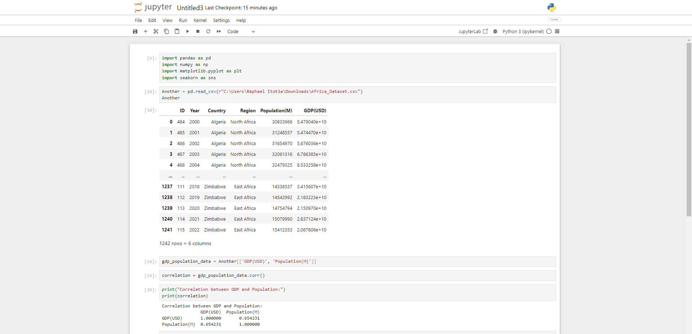
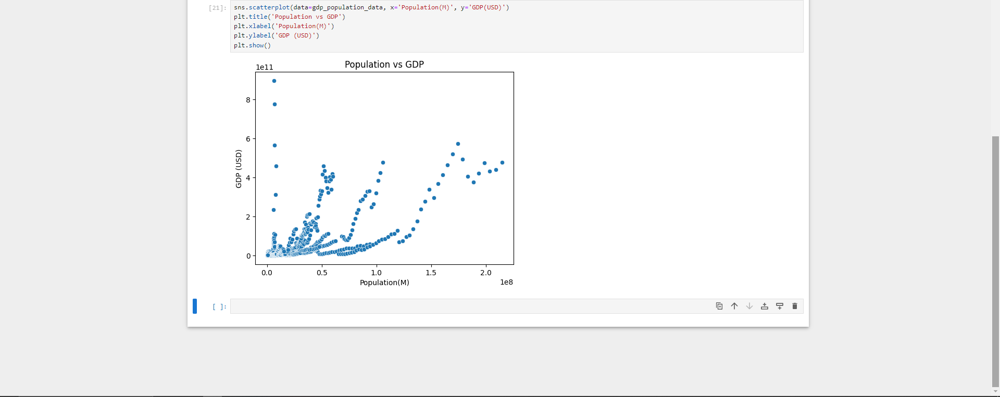
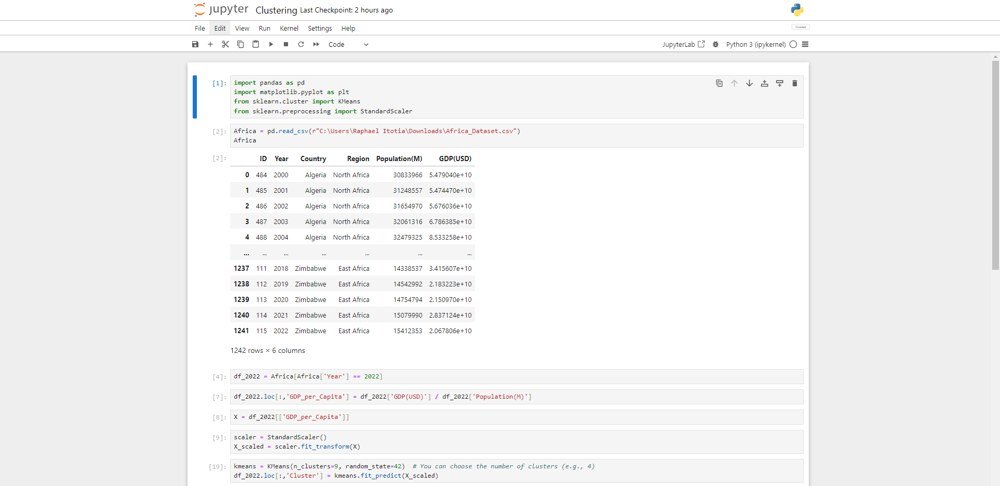
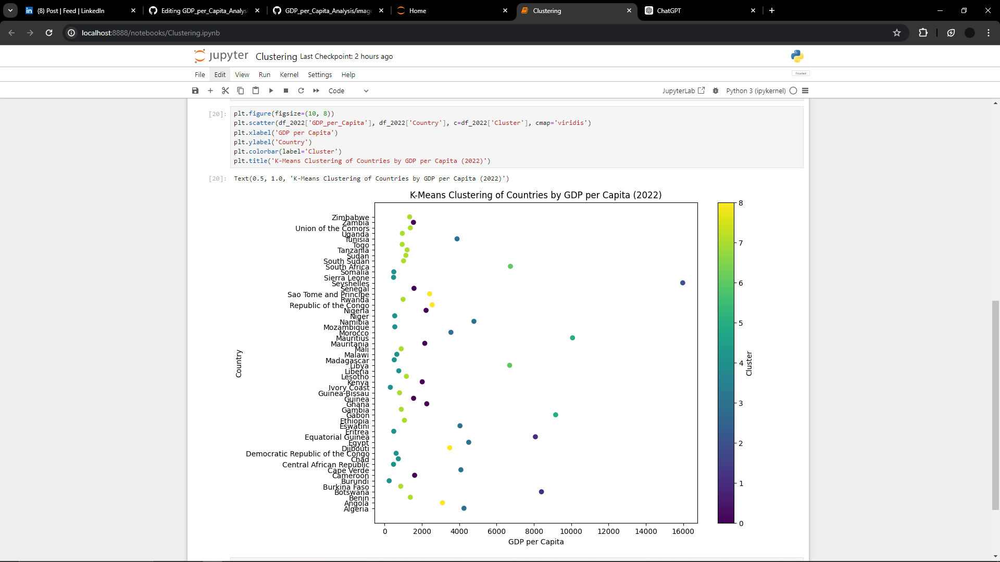
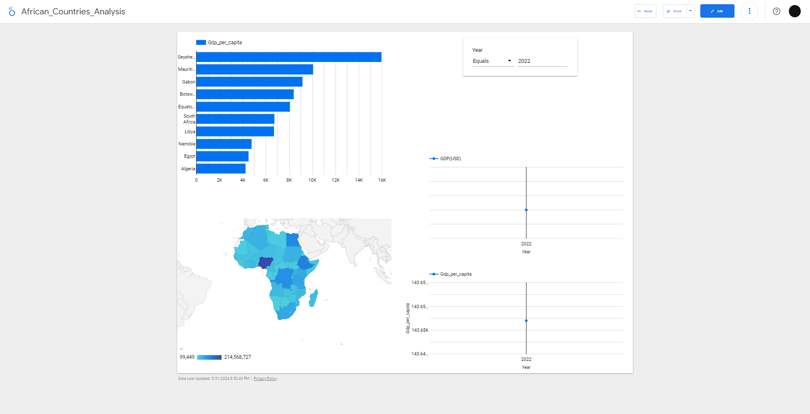

# African Countries Analysis
## with Python and Looker Studio

### Objective
To showcase my skills. Practice!

Answered following questions based on the analysis;
1. By 2022, which are the top 3 countries considering GDP per Capita?
2. Is there a correlation between population and GDP?
3. Which countries have similar economies considering GDP per Capita?


### Dataset Description 

Here is an understanding of the [data](https://www.kaggle.com/datasets/ivanbyone/population-and-gdp-africa).
The listing are a total of **1,242** with **6** unique columns.
   - ID: unique identifier for each listing.
   - Year: List of years that specifies country's population and GDP.
   - Country: consists of African countries.
   - Region: classification of countries based on geographical position on the continent.
   - Population: total number of people living in a particular country.
   - GDP(USD): measure for the size of country's economy.
 
### Analyzing with python

Launched Jupyter Notebook to run my python codes on.

I used python to answer question **2** and **3**.

- Is there a correlation between population and GDP?

Import the required packages:


```python
import pandas as pd
import numpy as np
import matplotlib.pyplot as plt
import seaborn as sns
```
Read my csv file into a Dataframe:
```python
Africa = pd.read_csv(r"C:\Users\Raphael Itotia\Downloads\Africa_Dataset.csv")
Africa
```
-------------
```python
gdp_population_data = Another[['GDP(USD)', 'Population(M)']]
```
```python
correlation = gdp_population_data.corr()
```
```python
print("Correlation between GDP and Population:")
print(correlation)
```
```python
sns.scatterplot(data=gdp_population_data, x='Population(M)', y='GDP(USD)')
plt.title('Population vs GDP')
plt.xlabel('Population(M)')
plt.ylabel('GDP (USD)')
plt.show()
```



Answer: Correlation between GDP and Population: 0.654231. There is a positive correlation meaning that as population increases, GDP also increases.

- Which countries have similar economies considering GDP per Capita?

```python
import pandas as pd
import matplotlib.pyplot as plt
from sklearn.cluster import KMeans
from sklearn.preprocessing import StandardScaler
```
```python
Africa = pd.read_csv(r"C:\Users\Raphael Itotia\Downloads\Africa_Dataset.csv")
Africa
```
```python
df_2022 = Africa[Africa['Year'] == 2022]
```
```python
df_2022.loc[:,'GDP_per_Capita'] = df_2022['GDP(USD)'] / df_2022['Population(M)']
```
```python
X = df_2022[['GDP_per_Capita']]
```
```python
scaler = StandardScaler()
X_scaled = scaler.fit_transform(X)
```
```python
kmeans = KMeans(n_clusters=9, random_state=42)  # You can choose the number of clusters (e.g., 9)
df_2022.loc[:,'Cluster'] = kmeans.fit_predict(X_scaled)
```
```python
plt.figure(figsize=(10, 8))
plt.scatter(df_2022['GDP_per_Capita'], df_2022['Country'], c=df_2022['Cluster'], cmap='viridis')
plt.xlabel('GDP per Capita')
plt.ylabel('Country')
plt.colorbar(label='Cluster')
plt.title('K-Means Clustering of Countries by GDP per Capita (2022)')
```




- By 2022, which are the top 3 countries considering GDP per Capita?

I used Looker studio.



Based on the visuals,

|Rank|Country|GDP_per_Capita|
|-----|----|----|
|1|Seychelles|15972.07|
|2|Mauritius|10069.44|
|3|Gabon|9165.17|


Please, I am aware that my findings are not accurate. This was only for practice.😊 
